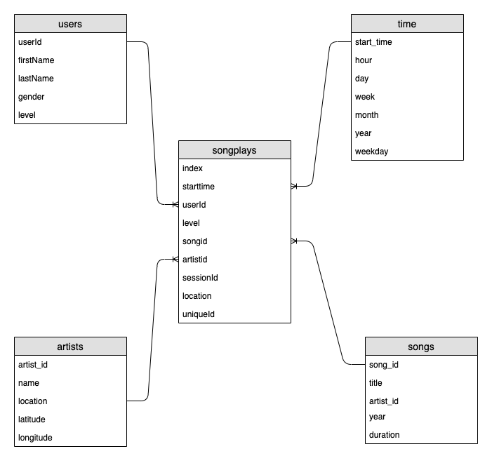

# Data Modeling with Postgres

## Description

A startup called Sparkify wants to analyze the data they've been collecting on songs and user activity on their new music streaming app. The analytics team is particularly interested in understanding what songs users are listening to. Currently, they don't have an easy way to query their data, which resides in a directory of JSON logs on user activity on the app, as well as a directory with JSON metadata on the songs in their app.

The objectif of this project is to create a Postgres database with tables designed to optimize queries on song play analysis and ETL pipeline for this analysis. 

## Modelisation

Using the song and log datasets a strat schema madel was creacted, with :

* **Fact table** : `songplays` table
* **Dimensional tables** : `users, songs, artists and time`



## ETL Process

The data is extracted from the song and log datasets. This data is transformed using `Pandas Python library`, and loaded into the database. 
* The song dataset provides song and artist information.
* Log dataset is used to create the time and users dimensional tables, as well as the songplays fact table.


## How To Start

1. Execute `create_tables.py`. This will create  the `sparkifydb` database with empty tables.

```
!python create_tables.py
```

2. Execute `etl.py`. This will load the data into the tables

```
!python etl.py
```